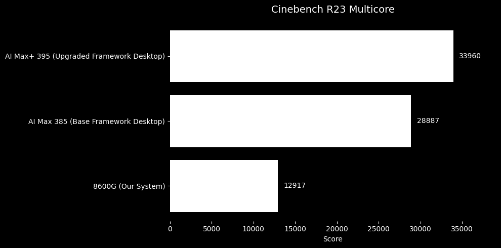
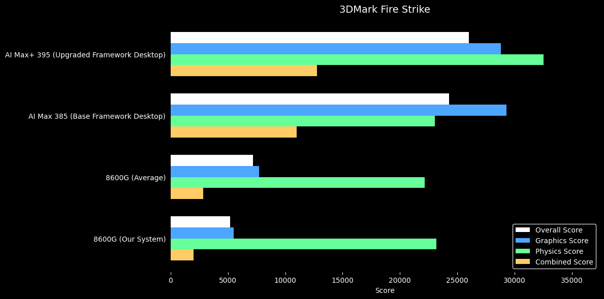
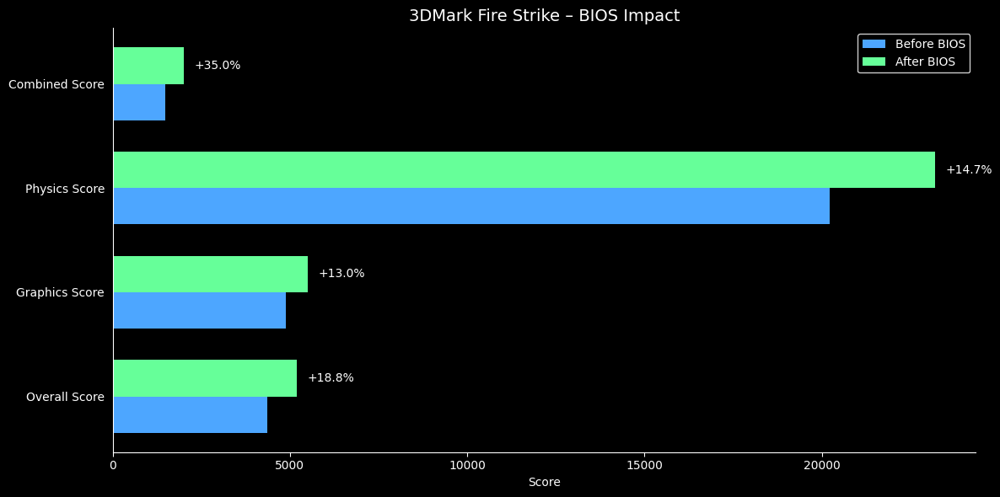
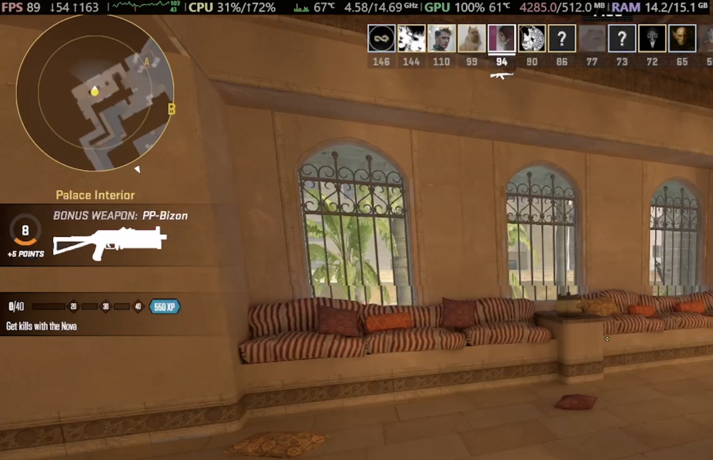
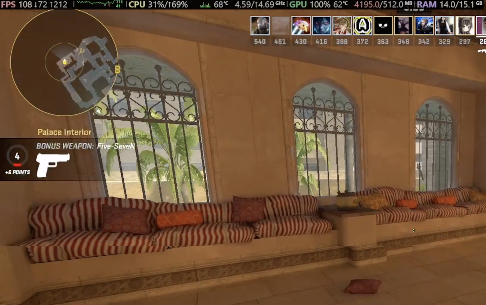
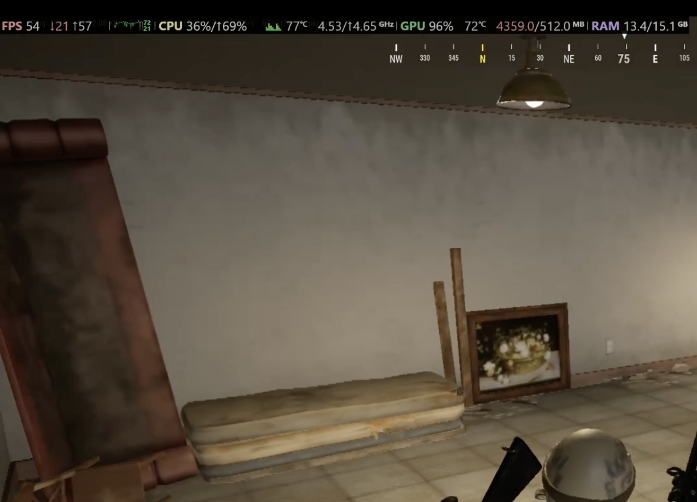
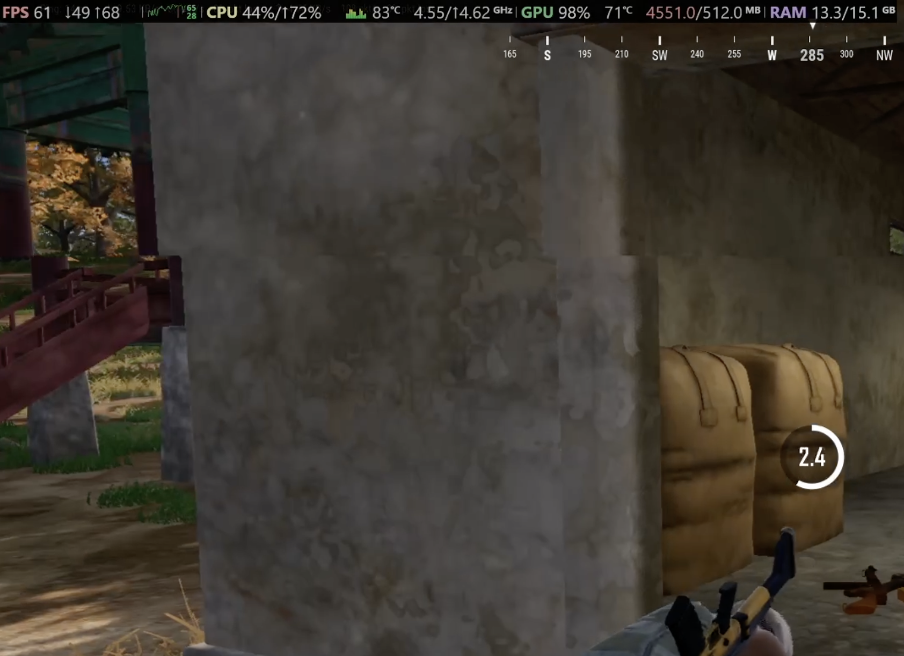

# I Bought the "Framework Desktop"

#### Specs
CPU: AMD Ryzen 8600g (210$)

GPU: AMD Radeon 760M (APU)

RAM: 16GB (2x8GB) ADATA DDR5 4800MHz (73$ **USED**)

MB: Gigabyte A620I AX (145$)

Case: Inwin Chopin MAX (115$)

SSD: ADATA Legend 860 (70$)

Total Price: 613$

#### Benchmarks

Before we start with the benchmarks I think it is very important to mention that all benchmarks were recorded using a **capture card** meaning that there are no performance losses. 

This specific part is divided into two categories. 

- General: Benchmarks taken after BIOS Update, that focus on comparison between the Framework Dekstop
- Before vs. After BIOS Update: As mentioned in the video, I performed all of the benchmarks before and after installing the newest BIOS update and this led to a very suprising performance boost which is talked about in this section

##### General
In Cinebench the biggest difference was in the multicore result.

I was a little dissapointed by the results. I did not expect my computer to perform so much worse compared to the average when it comes to the same CPU-GPU combo. But by my findings there are two reasons for this

- Low Memory Frequency: In my opinion the biggest reason. Because I was not able to buy faster RAM, the limited memory bandwidth caused the GPU to be limited.
- No Overclocking: Because of the A620 chipset which does not allow overclocking I was not really able to get everything out of the APU.

##### Before vs. After BIOS Update
Before the BIOS update the version of the bios was F23, first released in April 2024. I downloaded and installed the F38 Version and got the following difference in Firestrike.

I even reran cinebench but the difference in the results was basically zero meaning i did not include it here. This fact means that the biggest difference lies in the GPU.

When it comes to differences in gaming I managed to find how much FPS i had in the same stop at 1080p on Deathmatch Mirage in CS2. The difference is actually pretty significant as you can see. We went from 89 to 108 FPS. But the LOW and HIGH FPS stayed almost the same.

In PUBG the difference overall was not as significant. But this could be caused by the fact that I unfortunately tested everything on two different maps.

