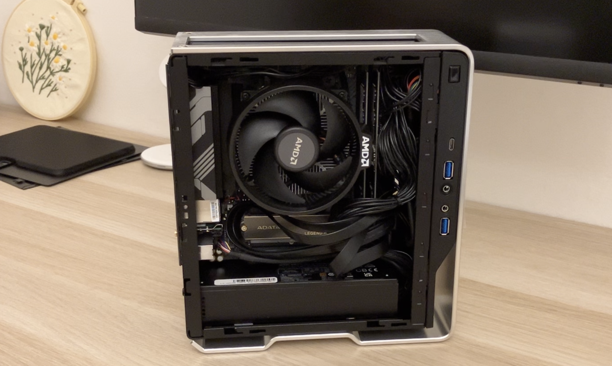

# I Bought the "Framework Desktop"

#### Specs
CPU: AMD Ryzen 8600g (210$)

GPU: AMD Radeon 760M (APU)

RAM: 16GB (2x8GB) ADATA DDR5 4800MHz (73$ **USED**)

MB: Gigabyte A620I AX (145$)

Case: Inwin Chopin MAX (115$)

SSD: ADATA Legend 860 (70$)

Total Price: 613$

